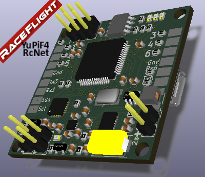
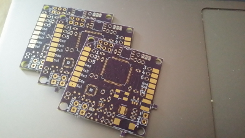

# YuPiF4
La YuPiF4 est un contrôleur de vol à base de STM32 F4, la FC est conçu pour fonctionner avec RaceFlight

Le développement de la FC YuPiF4 est conçu pour la course de FPV Racing avec un complément d'évolution sur le principe de module stackable.

- Format standard 36x36
- Alimentation direct Lipo 2s-6s 
- STM32F405 32 Bit, 168MHz, 1MB Flash
- MPU6500 SPI Gyro/Acc 
- 6 sorties moteurs (PWM)
- Entrée inversé SBUS
- Entrée PPM
- Port USB VCP dédié
- 3 ports series
- Port i2c
- Mémoire Flash 16Mb SPI pour l'enregistrement BlackBox
- Connecteur Molex pour le module GPS externe (Ublox, Baro, Mag)
- Connecteur externe SPI pour le module SdCard
- Régulateur 3.3v dédié STM32 - capteurs
- Bouton switch mode DFU - Boot0
- VBat
- RSSI
- Buzzer
- SWD Port

Site http://www.rcnet.com

